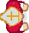

#############################
St. Nicholas Game Development
#############################

I'm planning to add a new game to the website for Christmas 2022, a game involving helping St. Nicholas deliver bags of
gold to poor families. The details of the game design will probably come to me gradually during the year and especially
as I work my way through similar tutorials. This document will serve as a place where I can jot down my ideas as they
come to me.

************************
Topdown Shooter Tutorial
************************

I am currently (starting in December 2021) working through the Topdown Shooter tutorial at:

https://www.youtube.com/channel/UCLzFt-NdfCm8WFKTyqD0yJw

and it has already given me a few ideas.

The St. Nicholas Sprite
=======================

The Kenney topdown shooter character spritesheet had a character I thought I could modify with GIMP to become a sprite
for the St. Nicholas character. This is how it looks now:

Node Based Composition
======================

In Part 7 of the tutorial, around 5:00, Joe speaks of "Node Based Composition" as a way of implementing DRY (Don't
Repeat Yourself). He says that Node Based Composition means to create a separate node within the scene that stores
the information needed and access it from there. This can help because it is a separate scene that can be dragged and
dropped into any other scene that needs it. Whether that will be helpful or not remains to be seen.

Dependency Injection
====================

I'm learning more about how to connect different nodes of my tree, a problem I had when writing the Concentration
program. In Part 8 of the tutorial he talks about something he calls "dependency injection" as a method for
easily making calls between nodes on the same level in the tree (sibling nodes, I believe). A higher level node sends
the necessary nodes to the lower-level nodes so that, if the hierarchy changes, the new information can be easily
changed in the calling function of the higher level node instead of my trying to find all the references to it.

*****************
Building the Game
*****************

Here I will describe the gradual development of the game. As it stands now, I only have a rudimentary idea of what I
want in the game but I think that is alright. Ideas will come to me as I start to build it.

Here is a table of contents:

#. :ref:`initial_ideas`
#. :ref:`first_steps`
#. :ref:`gold_bags`
#. :ref:`environment`
#. :ref:`hud`

.. _initial_ideas:

Initial Ideas
=============

 Meanwhile, here are my initial ideas:

#. It will be in the genre of the "topdown shooter" style of game but the "shooting" will actually be gift-giving. St.
   Nicholas will move through the town streets tossing bags of gold into the homes of needy people.
#. The game will have several levels, yet to be determined. Each level may contain any or all of the following:

   A. A maze of streets to get through to find the home(s) of needy people.
   #. Robbers who can steal gold from the kindly saint if they get close enough.
   #. Objects that can be picked up, as in an adventure game, to unlock doors or be rid of obstacles.

#. Perhaps the challenge of each level will have to be completed in a certain amount of time.
#. A HUD (Heads Up Display) can be used to display how many bags of gold St. Nicholas has left and the time remaining if
   that option is used.

.. _first_steps:

First Steps
===========

Here is a list of steps to complete as I start to build the game:

#. Create the game. (See :ref:`create_game`)
#. Create the St. Nicholas character and display it in the game. (See :ref:`st_nick`)
#. Add the ability to move St. Nicholas using the keyboard. (See :ref:`keyboard_move`)
#. Have the St. Nicholas character face the direction he is moving. (See :ref:`orienting_st_nick`)
#. Add the ability to move St. Nicholas with arrows on the display screen. (See :ref:`button_move`)
#. Save the St. Nicholas character in his own scene in an ``actors`` directory. (See :ref:`st_nick_to_scene`)

.. _create_game:

Creating the Game
-----------------

I'm going to have to come up with a good name for the game. Perhaps "St. Nicholas Adventure." Not bad for a first try.

I created a new Project called ``StNicholasAdventure`` and chose GLES2 as the renderer because that was suggested for
games to be played on the web.

Following Part 1 of the jmbiv tutorial (https://www.youtube.com/watch?v=gXkkNSfxLRI ) I started by changing
the default import preset to ``2D Pixel`` to simplify the bitmaps I will use in the game. This probably isn't really
necessary but, like the tutorial, I don't need the higher quality for this game.

I made the size of the game 800 x 600 to see if I like that. It should fit nicely into ten columns of a Bootstrap
container of the ``lg`` size. (See https://getbootstrap.com/docs/5.1/layout/containers/ ) The whole container is 960 px
wide so each of the twelve columns would be 80 pixels. Ten columns would be 800 pixels.

I set the game to expand and shrink with the size of the device on the ``General`` tab of
``Project->Project Settings...->Display->Window->Stretch``. I set the ``mode`` to ``2d`` and Aspect to ``keep``.

I elected to create a ``2D Scene`` which I called ``Main`` and saved it as ``Main.tscn`` in the default folder.

I ran the game and got a 800 x 600 grey box. Just what I wanted at this point!

.. _st_nick:

Displaying St. Nicholas
-----------------------

I added a ``KinematicBody2D`` as a child of the ``Main`` scene and a ``Sprite`` node as a child of that.

I created an ``actors`` folder under the ``res://`` folder and an ``images`` folder inside of that. I copied
the ``StNicholas.png`` image I had created earlier (apparently on the rectory computer) and add it as the texture for
the ``Sprite`` node.

The texture for the St. Nicholas character is 38 x 43. Perhaps my roadways should all be multiples of 50 pixels wide.

I added a ``CollisionShape2D`` as a child of the ``StNick`` node and gave it a ``CapsuleShape`` as its
``CollisionShape2D``.

I moved the character a litte into the game where it could be seen and, when I ran the game, it all looked good.

.. _keyboard_move:

Move St. Nicholas with Keyboard
-------------------------------

After watching Part 2 of the jmbiv Top-down Shooter Tutorial at https://www.youtube.com/watch?v=tIug3S4r5iE I was able
to get the St. Nicholas characted to move with the arrow keys, with the numpad keys and with the W, A, S and D keys
without difficulty.

Godot has default actions of ``ui_up``, ``ui_down``, ``ui_left`` and ``ui_right`` that are already connected to the
arrow keys and the numpad keys but, according to the documentation at: "Because these actions are used for focus they
should not be used for any gameplay code." That means I will need to create my own ``up``, ``down``, ``left`` and
``right`` actions and map all those keys to them. On the ``Input Map`` tab of the ``Project->Project Settings...``
window, I simply entered the names of the actions at the top and pressed ``Add``. Then I selected each one and clicked
the ``+`` button to add the arrow keys, each of the W, A, S  and D keys, and the corresponding joystick buttons. I used
``Key`` rather than ``Physical Key``. I don't yet completely know the difference.

I added a script to the ``StNick`` node and wrote the following code::

    extends KinematicBody2D

    export (int) var speed = 100

    func _ready() -> void:
        pass

    func _process(delta: float) -> void:
        var movement_direction := Vector2.ZERO

        if Input.is_action_pressed("up"):
            movement_direction.y = -1
        if Input.is_action_pressed("down"):
            movement_direction.y = 1
        if Input.is_action_pressed("left"):
            movement_direction.x = -1
        if Input.is_action_pressed("right"):
            movement_direction.x = 1

        movement_direction = movement_direction.normalized()
        move_and_slide(movement_direction * speed)

The St. Nicholas character now moves around in response to all the movement keys.

.. _orienting_st_nick:

Orienting St. Nicholas in the Direction of Motion
-------------------------------------------------

The only method I could find in the ``KinematicBody2D`` documentation, which is actually inherited from ``Node2D``,
is the ``look_at(Vector2 point)`` method. Since it takes a ``Vector2 point`` as its input I can't just use
``movement_direction``. I can, however, add the ``movement_direction`` to the character's ``global_position`` and use
that as the point to look at. So, all I had to do was to add the line:

    ``look_at(global_position + movement_direction)``

between the ``movement_direction = ...`` and ``move_and_slide(...`` lines in the code above.

.. _button_move:

Move St. Nicholas with Display Buttons
--------------------------------------

The St. Nicholas character also needs to move around on a cell phone or tablet screen that has no keyboard. I think that
adding arrow buttons to both ends of the screen should allow users of cell phones or tablets to play the game using
their thumbs on those buttons but I may have to investigate how this is usually done.

It seems that Godot's ``TouchScreenButton`` is what I should use. It can be configured, in the node editor I think,
to appear always, for testing, or only on touch screens, for deployment.

I found some game icons at https://www.kenney.nl/assets/game-icons and went to ``PNG`` folder to copy just the ones I
wanted. I started with the 2x size but may change that later. I put them in a new folder under the game folder called
``global images``.

I created four ``TouchScreenButton``s as children of ``Main`` and named them ``UpButton``, ``DownButton``,
``LeftButton`` and ``RightButton`` respectively. I drag/dropped the corresponding icon into the ``Normal`` property of
each. Later I may want to create images for the ``Pressed`` property.

I created a script under ``Main`` and added the following code::

    extends Node2D

    func _ready() -> void:
        $UpButton.action = "up"
        $DownButton.action = "down"
        $LeftButton.action = "left"
        $RightButton.action = "right"

For testing purposes I went to ``Project Settings`` under ``Input Settings->Pointing->Emulate Touch From Mouse`` and set
it to ``true``.

I tested the onscreen buttons with the mouse and they worked fine. Then I set the ``Visibility Mode`` to
``TouchScreen Only`` for each of the buttons but they still show up on my computer screen. That is because when
``Emulate Touch From Mouse`` is on, ``TouchScreenButton``\s are always visible.

.. _st_nick_to_scene:

Creating a Separate Scene for St. Nick
--------------------------------------

The ``StNick`` node now only exists as a child of the main scene. As in the jmbiv tutorial, I want to separate it into
its own scene. Right-clicking it in the tree and selecting ``Save Branch as Scene`` I placed StNick.tscn in the
``actors`` directory.

.. _gold_bags:

Bags of Gold
============

St. Nicholas can carry the bags of gold in his hand, but that makes it more likely that thieves will take them. If he
keeps them in his pocket they won't necessarily know he has them and may not bother him.

That may be a matter of setting the probabilities in some kind of a random function for the thieves but first I need to
implement the behavior of the bags of gold. Here is what needs to be done:

#. Find or Create an Icon for the gold bags. (See :ref:`gold_bag_icon`)
#. Create a separate scene for gold bags. (See :ref:`create_gold_bag`)
#. Implement the process for St. Nicholas to throw a gold bag. (See :ref:`throwing_gold_bag`)
#. Implement the hiding and revealing process for gold bags. (See :ref:`gold_bag_from_pocket`)

.. _gold_bag_icon:

The Gold Bag Icon
-----------------

I couldn't find any ready-made images of gold bags from Kenney so I went to https://openclipart.org and found something
I might be able to edit in Gimp. In the process I thought I might like to show that a bag had already been tossed in a
particular location by displaying an image of a bag that had opened and spilled a few coins so I also downloaded a
treasure chest for the use of its coins.

To look right the images can only be maybe 16 x 16 pixels, not a lot to work with! I finally settled on 20 x 20 but they
still look pretty tiny! Maybe they will look bigger in the game.

I did create textures for a bag for St. Nicholas to throw, and another one to lie open on the floor after he throws it.
Which brings to mind a question: what should happen if he throws it in the wrong place? Should he have to go pick it up
before the thieves get it?

.. _create_gold_bag:

Creating the Gold Bag
---------------------

The jmbiv Top-Down Shooter tutorial I am watching uses ``Area2D`` nodes for the bullets but I don't know if they will
be best to use for the bags of gold. I don't think they handle collisions and I might want my gold bags to collide off
walls and things if they are thrown from the wrong place. They should have to go through an open window I think.
``RigidBody2D`` nodes seemed too complicated to use in a top-down shooter so I settled on using a ``KinematicsBody2D``
node.

I will start, as he did in his tutorial, with a ``GoldBag`` as a child of the ``StNick`` node and already placed in his
right hand and then make it into it's own scene. I will create an ``objects`` directory for the ``GoldBag`` node in
anticipation of other objects that may be added later.

Once I did this I discovered a problem. Having two ``KinematicBody2D`` nodes in contact with one another, with their
``CollisionShape2D``\s overlapping meant they were always in a collision state. St. Nicholas went flying off the screen
to the upper left. I had to set the Collision Layers and Collision Masks for each object. I put St. Nicholas in layer 1
and turned off his interactions (turned off the mask) on layers one and two. I put the gold bag in layer 2 and turned
off his interactions with layers one and two. I set both of them to interact with layer 3 objects whatever they may turn
out to be. (I'm thinking walls and other things in the environment.)

Once I did that it started to work as expected, I could move St. Nicholas and the bag of gold moved with him but I don't
really like the looks of the bag of gold. It's too dark in color and doesn't look much like a bag of gold. I may try to
lighten it up, try for another image of a bag, or maybe just opt for gold coins which are readily available as game
assets.

I made some new textures which, for the moment, look better to me, though I may want to rotate it a little. I'm
currently using the 20 x 20 image: ``bag-of-gold-cartoon-small.png``.

.. _throwing_gold_bag:

Throwing the Gold Bag
---------------------

When the player hits the space bar, or a cell phone or tablet user hits some kind of a "Throw" button, the gold bag
should leave St. Nicholas in the direction he is facing and fly through the air to its landing place. Later I can
implement such things as checking that it really gets to a proper target area or if it bounces off walls or objects in
the environment. Here I am just concerned about it moving from St. Nicholas' hand to a certain distance away.

This may take some doing so I'll break it into steps:

#. Separate the GoldBag into its own scene. (See :ref:`gold_bag_scene`)
#. Display the GoldBag in St. Nicholas' hand. (See :ref:`gold_bag_in_hand`)
#. Set up the throwing input keys and stub in a procedure that will throw them. (See :ref:`throwing_input`)
#. Establish starting and ending points of the throw. (See :ref:`chart_throw`)
#. Animate the throw. (See :ref:`throw_animation`)

.. _gold_bag_scene:

Separating the GoldBag into its own Scene
^^^^^^^^^^^^^^^^^^^^^^^^^^^^^^^^^^^^^^^^^

This was easy and will help in the process of supplying ``GoldBag``\s in the future. This can be when St. Nicholas enters
a new level and starts with a certain number of gold bags or when he has lost some through bad throws or thieves and has
to go back home and pick up some more.

In the StNick scene I right-clicked the ``GoldBag`` and selected ``Save Branch as Scene`` and selected the ``objects``
directory for it where its images are already stored.

.. _gold_bag_in_hand:

Getting the GoldBag into StNick's Hand
^^^^^^^^^^^^^^^^^^^^^^^^^^^^^^^^^^^^^^

Then, as he did in Part 3 of the Tutorial (around 11:20), I can add a ``GoldBag`` to the StNick scene as a
``PackedScene`` export variable. This will allow me to create new instances of the ``GoldBag`` scene from within the
``StNick`` scene. I drag-dropped ``GoldBag.tscn`` into the ``StNick`` scene and deleted the ``GoldBag`` scene that used
to be there. Eventually, I think, some other part of the program will instantiate the gold bags but, for now, I will
create one in the ``_ready()`` function::

    func _ready() -> void:
        gold_bag = GoldBag.instance()
        gold_bag.set_position(Vector2(18, 17))
        add_child(gold_bag)

I had already moved the ``GoldBag``'s sprite into St. Nicholas' right hand but I zeroed that out since it will probably
complicate animating them when thrown. For now I will move it to his hand with the given ``position()`` method.

.. _throwing_input:

Input for Throwing
^^^^^^^^^^^^^^^^^^

In ``Settings->Project Settings`` on the ``Input Map`` tab, I added a ``throw`` action and connected it to the space
bar. I added the following code to ``StNick.gd`` to check its functionality::

    func _unhandled_input(event: InputEvent) -> void:
        if event.is_action_pressed("throw"):
            shoot()

    func shoot():
        print("St. Nicholas tossed a bag of gold.")

In the process I discovered that ``is_action_pressed`` worked better than ``is_action``. The latter fired twice for
every click of the space bar: once for the press, once for the release. It made more sense to me to throw the bag of
gold as soon as the key is pressed.

I also added a TouchScreenButton for the throwing action and placed it at the bottom of the screen. I tried to give it a
rough blue background but I don't like the looks of it. I think just white will go better with the arrow buttons I am
already using.

.. _chart_throw:

Mapping the Throw
^^^^^^^^^^^^^^^^^

For this I added a couple of ``Position2D`` nodes into the ``StNick`` scene. One, called ``HandPosition`` I placed at
(18,17), the position where the gold bag starts. The other, called ``TargetPosition`` is now at (171, -3) roughly 5 feet
directly in front of St. Nicholas. I may discover, depending on how I do the throw, that this ``TargetPosition`` node is
not necessary. I might want to bounce gold bags off of walls etc. and the target point would not always be hit. This is
not really like the top-down shooter's bullets.

.. _throw_animation:

Animating the Throw
^^^^^^^^^^^^^^^^^^^

Ruminations
"""""""""""

I think I'm right to use a KinematicsBody2D as the gold bag, allowing it to bounce off walls and other objects, but I
need to learn a lot more about how to use them in collisions. I don't recall too many tutorials about that aspect of
their abilities. The Godot documentation has what I think will be good to start with at:

        https://docs.godotengine.org/en/stable/tutorials/physics/using_kinematic_body_2d.html

I will try to study that first. (This is the one using ``KinematicBody2D``\s to implement bullets that can bounce off
walls.)

No sooner did I start that it directed me to their Physics Introduction:

        https://docs.godotengine.org/en/stable/tutorials/physics/physics_introduction.html#doc-physics-introduction

and now I'm thinking maybe gold bags should be ``RigidBody2D``\s instead. They might be able to do the bounces on their
own and may also benefit from using a physics material to provide such things as friction and the bounce of an object.
Physics materials are discussed at:

        https://docs.godotengine.org/en/stable/classes/class_physicsmaterial.html#class-physicsmaterial

The Physics Introduction explains how to use collision layers and masks and how to name them. Useful to know! Layers can
be used to tell the type of object -- their example is Walls, Player, Enemy and Coin. Masks are used to define what each
object can interact with, for instance, a Player should interact with Walls, Enemies and Coins, but an Enemy should not
interact with Coins. I seem to remember Yann, in the Udemy tutorial, saying something along the lines of "This object
IS A Player and it can INTERACT WITH Walls, Enemies, and Coins."

Reading the Physics Introduction makes me consider, again, that KinematicsBody2D nodes can be used for gold bags. I
would have to code the bounces, but KinematicsBody2d.move_and_collide() returns a KinematicCollision2D object which I
can use to help with that. Still, though, if a RigidBody2D takes care of that by itself, why should I?

Results
"""""""

I finally decided to use the RigidBody2D but was having trouble getting it to behave properly. When I threw a gold bag,
no matter where I was on the screen, it would pop back to its initial position before moving. The documentation had
warned me about that but, in my opinion, wasn't real good about explaining what to do about it. I finally found what I
needed at:

    https://www.youtube.com/watch?v=xsAyx2r1bQU

The problem was that I had to use the information in the gold bag's transform state. See:

    https://docs.godotengine.org/en/stable/classes/class_physics2ddirectbodystate.html

Manipulating that information in an ``_integrate_forces`` function is how it needs to be controlled.

Here are the current forms of ``StNick.gd`` and ``GoldBag.gd``.

**StNick.gd**::

    extends KinematicBody2D
    class_name Player

    export (int) var speed = 100
    export (PackedScene) var GoldBag

    onready var hand_position = $HandPosition
    onready var target_position = $TargetPosition

    var gold_bag: GoldBag = null

    func _ready() -> void:
        gold_bag = GoldBag.instance()			# temporary code for adding gold bag
        gold_bag.initialize(hand_position.position)
        add_child(gold_bag)

    func _process(delta: float) -> void:
        var movement_direction := Vector2.ZERO

        if Input.is_action_pressed("up"):
            movement_direction.y = -1
        if Input.is_action_pressed("down"):
            movement_direction.y = 1
        if Input.is_action_pressed("left"):
            movement_direction.x = -1
        if Input.is_action_pressed("right"):
            movement_direction.x = 1

        movement_direction = movement_direction.normalized()
        look_at(global_position + movement_direction)
        move_and_slide(movement_direction * speed)

    func _unhandled_input(event: InputEvent) -> void:
        if event.is_action_pressed("throw"):
            if gold_bag:
                throw(gold_bag)

    func throw(gold_bag):
        var toss_direction = hand_position.global_position.direction_to(target_position.global_position)
        gold_bag.toss(hand_position.global_position, toss_direction)

**GoldBag.gd**::

    extends RigidBody2D
    class_name GoldBag

    var impulse: int = 300
    var direction: Vector2 = Vector2.ZERO
    var tossed: bool = false

    func initialize(position):
        set_position(position)	# used only for development
        mode = MODE_RIGID

    func _integrate_forces(state: Physics2DDirectBodyState):
        if tossed:
            var xform = state.get_transform()
            xform.origin = get_parent().hand_position.global_position
            state.set_transform(xform)
            apply_central_impulse(impulse * direction)
            tossed = false
        else:
            if state.is_sleeping():
                print("The gold bag has landed.")

    func toss(start, direction):
        tossed = true
        mode = MODE_RIGID
        self.direction = direction

This is by no means final. The gold bags remain children of the St. Nicholas character and keep moving around with him.
They can also be thrown again, though they pop back into his hand first. The animation isn't great either. It looks like
a gold bag sliding on the floor more than a gold bag tossed through the air as seen from above. I have a lot of
:ref:`refinement <refinement>` to do.

.. _refinement:

Improving the Gold Bags
=======================

Toward the end Part 15 of the Top-down Shooter Tutorial by jmbiv (around 33:10):

    https://www.youtube.com/watch?v=S1Ao5SbqZL4&list=PLpwc3ughKbZexDyPexHN2MXLliKAovkpl&index=15

he shows how to use a ``RemoteTransform2D`` node to control the camera movements instead of having the camera be a child
of the player. That seems to me to be a way I can have the gold bags follow the player without having to be children of
the player. The way he set it up was to create the ``RemoteTransform2D`` node as a child of the ``Player`` node: the one
to be followed. Then, in the ``Player.gd`` script he created a variable to point to it and a function to be called by
his ``Main.gd`` program to set the camera (in the ``Main`` node) to follow the player. Here are the steps I think I need
to follow to apply this to getting my gold bags to remain in the hand of the ``StNick`` character until they are thrown
and then stay on the ground:

#. Create the ``RemoteTransform2D`` node in the ``StNick`` node. Name it ``StNickFollower``.
#. Create an ``onready`` variable to hold it. (Guess as to proper sequence based on observation of his work: signals,
   exports, regular vars, onreadys)
#. Create a ``set_st_nick_follower`` function to be called by ``StNick.gd`` with the path to the ``HandPosition`` node.
#. Write a line in ``func _ready`` in ``StNick.gd`` to call ``set_st_nick_follower`` with the path to ``HandPosition``.
   (``gold_bag.set_st_nick_follower(hand_position.get_path())``.
#. Experiment with the options having to do with rotation and position in the editor.

After completing the first four steps and trying the game I noticed that the gold bag was still acting like a child of
the ``StNick`` character. Not surprising since it was created in the ``StNick.gd`` script AS a child of the ``StNick``
character.

I decided to try my hand at creating a ``GoldBagManager`` node as a child of ``Main`` to manage the creation of gold
bags. It's not going well. More details to follow.

The gold bag doesn't seem to be following StNick's hand. That was because I set it up backwards. Since StNick is
supposed to be the one being followed, the ``RemoteTransform2D`` node needs to be in the ``StNick`` node and the
``NodePath`` to the gold bag needs to be set to it. Once I did that the gold bag followed St. Nick around, only... it
was on his head, and tossing didn't work anymore. Perhaps the first thing to do upon tossing the gold bag is to release
it from the hold of the ``StNickFollower``. Yes, that was it, but it took me a while to realize that the way to
release it was to set the ``st_nick_follower.remote_path`` to the empty string ("").

Now I just have to get the gold bag to appear in StNick's hand and prevent it from being thrown again once it is on the
ground.

The first part of that was easy. Somehow the ``HandPosition`` itself was changed to the middle of StNick's head. When I
moved it, the gold bag moved there too.

I write this a few days later but preventing the bag from being thrown again had to do with using a ``tossed`` variable
initialized to ``false`` but set to true in the ``tossed()`` function.

For some reason the ``_integrate_forces())`` function is not called until the bag is tossed and then it is called
repeatedly. Can I turn it off?

Yes, when a RigidBody2D is set to MODE_STATIC the ``_integrate_forces()`` function is not called. So here is the present
form of ``GoldBag.gd``::

    extends RigidBody2D
    class_name GoldBag

    var impulse: int = 300
    var direction: Vector2 = Vector2.ZERO
    var tossed: bool = false
    var physics_triggered = false

    func _integrate_forces(state: Physics2DDirectBodyState):
        if state.is_sleeping() and physics_triggered:
            set_deferred("mode", MODE_STATIC)
        physics_triggered = true
        apply_central_impulse(impulse * direction)
        direction = Vector2.ZERO

    func toss(start, direction):
        if not tossed:
            tossed = true
            mode = MODE_RIGID
            self.direction = direction

The gold bag's ``mode`` is initialized, through the editor, to MODE_STATIC. When the toss button is pressed, ``tossed``
is set to ``true`` and the ``mode`` is set to MODE_RIGID. The ``_integrate_forces`` function is automatically called
repeatedly. The first time through, ``physics_triggered`` starts out false, so the ``mode`` remains as ``MODE_RIGID``.
Then ``physics_triggered`` is set to true, the impulse is applied, then the direction set to ``Vector2.ZERO`` so that
it is only applied once. When the body enters the "sleeping" state, its ``mode`` returns to ``MODE_STATIC`` and the
physics process turns off. I found that if the sleeping state is checked right after the call to
``apply_central_impulse()`` it never triggers. Probably because it is figuring the zero impulse. There is probably a
better way to do this but this is working for now.

.. _environment:

Environment and Camera
======================

Edits to the Tilesheet
----------------------

I'm planning on using an edited version of the Kenney topdown_shooter_tilesheet. In Gimp, I've gotten into the
``Color->Hue, Saturation and Value`` menu and lowered both the saturation and the value (or is is lightness?) This was
to make it look more like the environment is in the dark. Perhaps I should also give it a slight blue tint.

Using the Tilesheet in Godot
----------------------------

Godot's tilesheet process leaves something to be desired. It seems confusing and sometimes irreversible. Here are some
notes for using it:

General
^^^^^^^

These things must be done whenever you use a TileSheet:

Adding the TileSheet
""""""""""""""""""""

#. Add a TileMap node to the scene.
#. In the inspector, click next to "Tileset:" where it says "[empty]".
#. Click "New Tileset" and select the tileset you want to use.
#. Click the new "TileSet" resource to open the TileSet editor.
#. Click the "[+]" button at the bottom left and select the TileSet you created above.
#. You are now ready to create various kinds of tiles. You will have to drag select the first time to get the snap
   option to appear, and adjust the size of the cells to match the tileset in the Snap Options that will now appear in
   the inspector.

Adding TileSheet Elements to the Environment
""""""""""""""""""""""""""""""""""""""""""""

#. Click on the TileMap node you want to contain the item or items you are going to add.
#. Icons of the available tiles appear at the right. Click-select one to draw on the environment.
#. Add the item in one of the following ways:

   A. Left-click the environment where you want it to be placed. (Right click to erase.)
   #. Shift-left-click to drag a line of them. (Shift-right-click to erase.)
   #. Ctrl-Shift-left-click to drag a block of them. (Ctrl-Shift-right-click to erase.)

#. Make sure that "Enaple Priority" is set the way you want.

Single Tile
^^^^^^^^^^^

Single tiles are used to place individual items in the environment.

#. Click on the "+ New Single Tile" button at the upper right.
#. Click select the tile you want to use.
#. Change its name in the inspector under "Selected Tile->Name" if desired. (There is a round button marked with an "i"
   at the upper right that toggles the visibility of the names.

AutoTile
^^^^^^^^

Auto tiles are used for such things as drawing buildings.

#. Click on the "+ New AutoTile" button at the upper right.
#. Drag around the desired region on the tile sheet.
#. Give the region a name, if desired, by using the inspector under "Selected Tile->Name".

Making it Automatic
"""""""""""""""""""

#. Click the "Bitmask" tab.
#. In the inspector, under "Selected Tile" change Autotile Bitmask to 3.3 minimal if the subtiles are too large.
#. Click to set the bitmask on all "open" areas -- places without walls. Left-click sets, right-click erases.
#. If desired you can select an icon tile.

Giving the Tiles a Collision Region
"""""""""""""""""""""""""""""""""""

#. If necessary, click on the name of the region you want to edit.
#. Click on the Collision tab.
#. Select each tile, one after another then:

   A. Click on the Rectangle button.
   #. Click back on the tile to create the collision area.
   #. Don't forget to set the "is a" and "interacts with" levels on the corresponding TileMap node in the inspector.

AtlasTile
^^^^^^^^^

Atlas tiles are used to draw such things as various types of ground.

#. Click on the "+ New Atlas Tile" button at the upper right.
#. Drag around the desired region on the tile sheet.
#. Give the region a name, if desired, by using the inspector under "Selected Tile->Name".
#. Adjust priority, if desired, by selecting a tile and typing in (or using the up and down arrows on the control) to
   set the priority of each tile in the set.

Camera Movement
---------------

Now that I have the ability to build a large "playing field" I want to have the camera follow St. Nicholas around as he
strives to give gold to the poor. The St. Nicholas character is not going to die, so I think I can just make the camera
a child of the ``StNick`` node as Joe did at the beginning of Part 13 of the topdown shooter tutorial. To make it work I
also had to click "Current" in the inspector, making it the current camera. As he did in the tutorial, I also enabled
"Smoothing."

Gold Bags and Targets
=====================

I've been putting this off for a while, partially because I don't know how to do it, and partially because I haven't
decided what to do. My original thought of tossing the gold bags through a window isn't working the way I thought.
Buildings are collision objects, so gold bags should bounce off of them -- even parts designated as windows. I say
gold bags SHOULD bounce off of them because, currently, they just stick to them. I haven't finished whatever I'm
supposed to do to get them to bounce.

Currently I'm thinking of creating another layer for buildings, above the obstacles layer, but with no collisions, or,
since it's already built in to the tilemap, I can use the inspector to turn collisions off for that layer. Then I can
either create a special building that can accept gold bags or use some single tiles to paint over existing buildings and
use an ``Area2D`` to detect the gold bag when it enters and trigger the animation.

But, before I do any of that, I want to create a means of giving St. Nicholas a "pocket" to hold a few gold bags that he
can then give to the poor.

.. _gold_bag_from_pocket:

Getting Gold Bags from the Pocket
---------------------------------

I think this is going to be something like the ``BulletManager`` in the jmbiv tutorial. There, the ``BulletManager`` is
``Node2D`` that only contains a script and the script does very little, only having one function to handle a bullet that
is spawned elsewhere. Here is what takes place when the player fires a bullet:

+----------------------------------------------+--------------------------------------------------+
| **Sequence of Events**                       | **Additional Notes**                             |
+==============================================+==================================================+
| 1. The "shoot" action is discovered in the   | The "shoot" action is set in the Input Map in    |
|    _unhandled_input function of Player.gd,   | the Project Settings.                            |
|    which calls "weapon.shoot()"              |                                                  |
+----------------------------------------------+--------------------------------------------------+
| 2. The "shoot" function of the player's      | The "bullet fired" signal is created in          |
|    weapon creates the bullet, calculates its | "GlobalSignals.gd" and has parameters of         |
|    direction of motion, and emits the        | bullet, team, position and direction.            |
|    "bullet fired" signal.                    |                                                  |
+----------------------------------------------+--------------------------------------------------+
| 3. The "bullet_fired" signal is picked up by | The "BulletManager" uses the parameters to add   |
|    "Main" and connected to the               | the bullet as its own child and set its team,    |
|    "handle_bullet_spawned function of the    | position and direction of motion.                |
|    "BulletManager."                          | "BulletManager" is already a child of "Main."    |
+----------------------------------------------+--------------------------------------------------+
| 4. From that point on the "Bullet" takes care| A "Bullet" is an Area2D and uses a different     |
|    of itself, moving, handling collsions, and| method for movement. in "_physics_process", the  |
|    removing itself from the queue once it    | is calculated and added to the global_position   |
|    enters a body with a "handle_hit"         | of the bullet.                                   |
|    function.                                 |                                                  |
+----------------------------------------------+--------------------------------------------------+

I think what I have in mind for the gold bags is quite a bit simpler than all that. Here is what I imagine the sequence
of events to be:

#. St. Nicholas first appears without a gold bag, but the number in his pocket is indicated in the UI.
#. The player clicks the key or button designated for getting the gold bag out and ready to throw.
#. The gold bag is created and made visible in St. Nick's hand. Perhaps a sound can go with that. Now it is ready to
   throw.

This would seem to require:

#. A variable within ``StNick.gd`` indicating the number of gold bags left.
#. A function to initialize the number of gold bags. (Different for different levels?)
#. Setting up the key and button for getting the gold bag out and ready to throw.
#. A boolean variable indicating the gold bag is visible (which may attract thieves). This should probably be in
   ``GoldBag.gd``. Something like this may also be needed to indicate when a gold bag can be thrown -- only when it's
   out of his pocket.

.. _targets:

Creating Targets for Gold Bags
------------------------------

I tried adding a ``Targets`` layer and plopping a "window" without a collision shape on one wall of a building from the
building layer, hoping St. Nick could toss the bag through it but, unfortunately, the building that still existed
underneath still blocked the gold bag.

That time I copied the ``Targets`` layer from one of the others to be able to reuse the texture map. I'll try again but,
this time, create a new ``TileMap`` node with a new copy of the tilesheet. This one will be identical to the other but
with no collision shapes. The buildings can be built from single tiles. I will have to devise some method of building a
building underneath, in the ``Buildings`` layer to prevent St. Nick, or the gold bags, from going through the walls.

That worked! Well, except for the part about St. Nicholas being able to walk through the window/door. I fixed that by
giving my ``Target`` windows a collision shape and setting the collision layers so that they interacted with St. Nick
but not with gold bags.

Currently I have to add a blank (black) tile in the building layer under the window tile otherwise the grass shows
through. I may want to edit the texture to put a black background in all four of the window tiles.

Making Gold Bag Activity More Elegant
-------------------------------------

Now that I am finally able to toss gold bags into buildings I want to improve the look and feel of gold bag actions.
Specifically I would like to:

#. Have the gold bag bounce off a wall when hitting it directly instead of sticking to it. (See :ref:`gold_bag_bounce`)
#. Have the gold bag fall open when it hits the ground, at least if it lands on a proper target. (See
   :ref:`open_gold_bag`)
#. Have the gold bag stop more suddenly somehow so it looks like it's actually landing on the ground instead of sliding
   over it. (See :ref:`sudden_stop`)
#. Play a clinking sound when landing on the ground or when hitting a wall. (See :ref:`sudden_stop`)
#. Allow St. Nicholas to pick up a gold bag that has been dropped along the roadside -- if he can get there before a
   thief or an animal gets it, or maybe just one of the townspeople. (See :ref:`pick_up_gold_bag`)

.. _gold_bag_bounce:

Bouncing the Gold Bag
^^^^^^^^^^^^^^^^^^^^^

When a gold bag bounces off a wall at an 45° angle, it looks good, it even gives the bag a bit of a spin after the
bounce. (I wonder if I should give it some spin before the bounce.) But if the gold bag hits the wall at 90°, or an
angle of incidence of 0°, it just stops, kind of stuck to the wall. I'm not sure why this should be. Perhaps I can
research it...

It turned out to be really easy, though I didn't recognize it at first. In the Inspector for the Gold Bag node, a
RigidBody2D, I clicked on the PhysicsMaterial and set the Bounce all the way to 1. That seemed to solve the problem.

.. _open_gold_bag:

Opening the Gold Bag when it Lands
^^^^^^^^^^^^^^^^^^^^^^^^^^^^^^^^^^

Instead of letting the gold bag slide to a stop, as it does outside the building, I'd like it to come more suddenly to
a stop and fall "open," actually just switching the image. It seems I should be able to use an ``Area2D`` node to detect
when a gold bag enters and then trigger whatever actions I want to apply from there. Unfortunately, I haven't been able
to get the ``Area2D`` to trigger. I have it in its own "Landing Zone" collision layer, marked to interact with gold
bags, and the gold bags are marked to interact with the "Landing Zone" but nothing happens when I toss the gold bag into
the Landing Zone. Time for more research...

According to:

    https://www.youtube.com/watch?v=cQyyD-ykAHU

the signal I need to be using is ``body_entered`` rather than ``area_entered`` which is what I am currently using and
which only applies when another ``Area2D`` enters. Once I made that change I could detect the entrance of the gold bag.

.. _sudden_stop:

Bringing the Gold Bag to a Sudden Stop
^^^^^^^^^^^^^^^^^^^^^^^^^^^^^^^^^^^^^^

Using an Area2D
"""""""""""""""

I'd like the gold bag to more suddenly come to a stop when landing in a target area -- justifying the bag falling open.
Perhaps I should do that with every throw, perhaps not. For now I'll depend on the ``Area2D`` detection to change the
friction.

Changing the value of the friction property didn't seem to do much. After some experimentation I discovered that
changing the value of the linear_damp property gave me more what I wanted.

Using an Animation Player
"""""""""""""""""""""""""

It occurs to me that the animation of the gold bag might be assisted by the use of an animation player to call the
shots at the right times. Here is a list of things that I think an animation player can handle:

#. Calling a function to start the toss. (Thus, the toss button will start the animation player.)
#. Make the image of the gold bag grow slightly as it rises.
#. Make the image of the gold bag shrink as it falls.
#. Play the coin clink sound when it hits the ground.
#. Sharply increase the linear_damp property after it falls.
#. Change the image to an open gold bag at the end of the toss.

Here is the sequence I followed while trying to implement this idea:

+-------------------------------------------+--------------------------------------------------------------------------+
| **Action**                                | **Notes**                                                                |
+===========================================+==========================================================================+
| Add an Animation Player to the GoldBag    | I added an animation called "toss" and gave it a length of 0.5 seconds,  |
| node. Call it TossAnimation.              | which is about the time an object would take to fall from a height of    |
|                                           | one meter.                                                               |
+-------------------------------------------+--------------------------------------------------------------------------+
| Add a property track to animate the       | I set two keys: one at the beginning for the regular bag, one toward the |
| texture property of the Sprite node.      | end for the open bag. Timing needs attention but it works.               |
+-------------------------------------------+--------------------------------------------------------------------------+
| Add a property track to animate the       | I found the scale property by scrolling down to the Sprite's Node2D      |
| scale property of the Sprite node.        | properties. See https://www.youtube.com/watch?v=nnMu8s8RlYM from about   |
|                                           | half way through the video.                                              |
+-------------------------------------------+--------------------------------------------------------------------------+
| Fixed the texture and scale properties    | The animation leaves the gold bag open and smaller. It needs to be       |
| when creating a gold bag.                 | created with the proper texture and size. See the code                   |
|                                           | :ref:`here <fix_texture>`.                                               |
+-------------------------------------------+--------------------------------------------------------------------------+
| Add the coin sound to the end of the      | I first needed to add an AudioStreamPlayer node to the GoldBag scene. I  |
| animation, as the gold bag opens.         | called it LandingSound.                                                  |
+-------------------------------------------+--------------------------------------------------------------------------+
| Adjusted the z-index of StNick so that he | I first tried animating the z-index of the gold bag itself but then it   |
| is rendered above the gold bags.          | disappeared under the ground when it landed.                             |
+-------------------------------------------+--------------------------------------------------------------------------+
| Add a sound for when a gold bag collides  | I used the GoldBag's body_entered signal, set contacts_reported = true   |
| with something.                           | and contacts_monitored = 1 in the Inspector and added an                 |
|                                           | AudioStreamPlayer called CollisionSound. I had to re-import the desired  |
|                                           | sound file and turn off "looping" there and in the inspector.            |
+-------------------------------------------+--------------------------------------------------------------------------+
| Add a property track to the GoldBag's     | I used three keys: one at the beginning set to -1, one just one step     |
| angular_damping property to let it rotate | before the landing set to -1, and one at the landing set to 20 to allow  |
| after a bounce but stop upon landing.     | for a slight bit of rotation after the landing.                          |
+-------------------------------------------+--------------------------------------------------------------------------+

.. _fix_texture:

**Code for Fixing Gold Bag Texture and Scale** (see above)::

    func create_gold_bag(hand_position, main_node) -> GoldBag:
        gold_bag = GOLD_BAG.instance()
        var texture = load("res://objects/images/bag-of-gold-cartoon-small.png")
        var sprite = gold_bag.get_node("Sprite")
        sprite.texture = texture
        sprite.scale = Vector2(1, 1)
        main_node.add_child(gold_bag)
        return gold_bag

Detecting a Success
^^^^^^^^^^^^^^^^^^^

Detecting when St. Nicholas has successfully tossed a bag of gold into a poor person's house is quite simple using an
Area2D. Simply send an ``_on_Area2D_body_entered`` signal and process it there. I put it in ``GoldBagManager.gd`` and,
to start, simply printed a message from the poor person thanking St. Nicholas.

But what should happen? Perhaps the number of successes can be counted and displayed next to some smiling faces on the
scoreboard. Or, each success could score a number of points. In any case, it shouldn't be hard to implement, the
question is, where do the points go? In ``Main.gd``? In ``Player.gd``? In some general repository of game information?
I looked at the *Discovering Godot* course I got through Udemy:

    https://www.udemy.com/course/draft/1647296/learn/lecture/14615846#overview

to see what he did. He used a separate repository of game information he called ``gamestate.gd`` which, like
``actor.gd`` and ``ai.gd`` scripts in the Topdown Shooter tutorial, can be related to several different nodes or
scenes. That's what I will do. Here is what I did:

#. Created a ``Gamestate.gd`` script in the main folder: ``:res:``.
#. Gave it the class name of "Gamestate".
#. Put in a variable called ``smiles`` as an integer initialized set to zero.
#. Added a ``Node`` to ``Main`` called ``Gamestate`` and clicked the add script button. It recognized that
   ``Gamestate.gd`` already existed and I took the option of loading it.
#. Following the "Discovering Godot" course I put ``add_to_group("Gamestate")`` in a ``_ready()`` function.
#. Using the technique he used in the course I put ``get_tree().call_to_group("Gamestate", "add_smiles", 1)``.

I used a ``add_smiles()`` function, instead of ``add_smile()`` with the idea that I might want to associate the number
of people affected by St. Nick's generosity with the Area2D that marks the targets. I could make each ``Area2D`` into
a target scene with it's own tilemap and export variable for the number of people affected and perhaps other things that
might occur to me later. I would still have to build special buildings to provide the obstacles, or perhaps I could use
the obstacle layer under the target building (without collision shapes) to provide for collisions. Hmmm...

<Discuss implementing the above here>

More Gold Bag Operations
------------------------

Initial Thoughts
^^^^^^^^^^^^^^^^

It might be useful to enable St. Nicholas to pick up a gold bag he drops, if he can do it before something else happens
to it, like an animal scurrying in to whisk it away, or a thief be attracted to it, or one of the townspeople. When he
picks it up it should go back into his pocket, out of sight. Or maybe not, he might want to try to throw it again right
away. But he should be able to put it back in his pocket if he is going to be travelling for a while, no sense
attracting thieves!

Here is a list of things to implement:

#. Picking up a gold bag from the ground. (See :ref:`pick_up_gold_bag`)
#. Putting a gold bag back in his pocket. (See :ref:`pocket_gold_bag`)

.. _pick_up_gold_bag:

Picking Up a Gold Bag
^^^^^^^^^^^^^^^^^^^^^

It would seem that St. Nicholas would have to be close to the gold bag, but not on top of it, and facing the gold bag
to pick it up. Once all those conditions are met the alt-G key combination should play a sound and place the gold bag
back in St. Nick's hand. There will also have to be another icon for cell phone and tablet players to use. Here is what
I think I need to do:

#. Add the alt-G key combination to a ``pick_up`` action.
#. Add a new TouchScreenButton for the ``pick_up`` action.
#. Decide on the distance range within which a gold bag can be retrieved.
#. Determine whether the gold bag is someplace where it would be visible to St. Nick. The *Discovering Godot* course may
   be useful here, the part in Heist Miesters with the flashlights.
#. If all conditions are met, play a "collecting gold coins sound" and put the gold bag in St. Nick's hand.

Here are some notes in implementing the above:

#. Adding an action activated by ALT-G turned out to be more complicated than I thought. Even though I added a
   ``pick_up_gold_bag`` action and connected it to the ALT-G combination, the ``get_gold_bag`` action fired anyway
   because the G key was pressed. I had to add some logic to the input section of St. Nick's ``_process`` function to
   distinguish between the two cases.
#. I copied the TossButton and adjusted the x values of the positions of the two similar buttons. Temporarily I'm using
   the purple-background version of the toss button for the pick up button until I can get a better icon -- perhaps for
   both of those buttons.
#. From the size of the ``StNick`` sprite I would say the gold bag must be between 10 and 30 pixels away from his
   ``global_position`` and within a certain area in front of him.
#. I added an ``Area2D`` called ``PickUpArea`` to the ``StNick`` scene to help determine whether a gold bag is in reach.
   I added a ``CollisionPolygon2D`` to that and drew a shape I thought about right. I connected the ``body_entered`` amd
   ``body_exited`` signals of ``PickUpArea`` to change the state of an ``in_reach`` variable in the gold bags. I checked
   to see if it was a ``GoldBag`` that entered with ``if "GoldBag" in body.name`` because when there is more than one
   gold bag they get names like: ``@GoldBag@2``.
#. Determining whether all conditions were met required that I add each gold bag to a ``GoldBag`` group, which I did in
   the inspector. then I needed to add a ``received`` variable to indicate if the gold bag has been taken by its
   intended receiver or by someone else. Finally, for each gold bag that has been tossed (thus not still in St. Nick's
   hand) but not received a series of pick-up actions take place:

   A. A sound plays to indicate collecting the coins into the bag.
   #. The open bag shrinks to nothing very quickly.
   #. The closed bag grow while moving to St. Nick's hand.
   #. The ``GoldBag`` variables ``tossed`` and ``in_reach`` are both set to false.
   #. The gold bag's position must again follow St. Nick's hand so that it will be thrown from there. (See
      :ref:`below <pin_gold_bag>`.)

   #. Determine whether it is in StNick's field of view. (See
      https://www.udemy.com/course/draft/1647296/learn/lecture/17264166#overview starting at about 7:00.)

.. _pin_gold_bag:

Once picking up a gold bag from the ground, I thought I could make it follow St. Nick with the following command:

    ``st_nick_follower.remote_path = gold.bag.get_path()``

which it did, but upon tossing the gold bag again it would revert back to the position it had when on the ground. By
accident I discovered that when I accessed the gold bag's global position, at least in a print statement, the problem
was corrected. I didn't think I could count on that, though, so I studied up on how to change the position of an object
in ``_integrate_forces`` and ended up with the following:

#. In the ``GoldBag`` scene I created two new variables: ``new_position`` a ``Vector2`` orinially set to
   ``Vector2.ZERO``, and ``change_position``, a boolean originally set to ``false``.
#. Created a ``reposition`` function in ``GoldBag`` as follows::

    func reposition(new_place: Vector2):
        new_position = new_place
        change_position = true

#. Added a section to the beginning of ``_integrate_forces`` as follows::

    	if change_position:
            var new_transform = state.get_transform()
            new_transform.origin = new_position
            state.set_transform(new_transform)
            change_position = false

#. Called ``gold_bag.reposition(hand_position.global_position)`` in ``StNick``\s ``throw`` method.

There is still more that needs to be done. For instance, after tossing a bag, tossing a second one, then going back and
picking up the first bag; if I toss it, it just drops silently to the ground and can't be picked up. Doing some print-
debugging I see that is because the ``throw`` method uses the global value of ``gold_bag`` which needs to be changed in
``pick_up_gold_bag``. Adding ``self.gold_bag = gold_bag`` to the ``pick_up_gold_bag`` function solved that problem.

There is still a problem with trying to pick up more than one gold bag at a time. If two or more are withing the
``PickUpArea`` when I do a pick-up action, they all get picked up, but only one ends up in St. Nick's hand. The others
remain on the ground, closed and unable to be picked up. I think I need to break out of the loop that iterates through
all the gold bags so that it stops after finding the first one.

That worked but, while checking it, I noticed that St. Nick threw one of the gold bags backwards! I don't know why. When
I tried it again it worked fine. I hope it's not one of those difficult to reproduce problems that are also difficult to
solve but keep happening every now and then.

The next day I checked it again and it worked fine, though the pick-up animation definitely needs improvement. I did see
a brief flash of the bag back at it's pick-up position when throwing it once. Perhaps a fluke or something that will
happen occasionally if the system gets to the ``toss`` function before it has displayed the repositioned gold bag.

.. _pocket_gold_bag:

Pocketing a Gold Bag
^^^^^^^^^^^^^^^^^^^^

Putting a gold bag back in St. Nick's pocket is actually a matter of destroying it and adding one to the number of bags
(``num_bags`` currently defined in ``StNick.gd``. I wonder if it should be in ``GoldBagManager.gd``.) Before the bag is
destroyed, however, it should play an animation where it shrinks to nothing. Here is my plan:

#. Create an action, tied to the "P" key to pocket the gold bag in St. Nick's hand.
#. Create a ``pocket_gold_bag`` function in ``StNick.gs`` to pocket the currently held gold bag (or other future gifts?).
#. Call the ``pocket_gold_bag`` function when the "P" key is pressed.
#. Create a ``back_to_pocket`` animation in ``GoldBagAnimations``.
#. Once the animation has stopped playing, destroy the gold bag and increment the ``num_bags`` counter.
#. Add a ``TouchScreenButton`` for the pick-up action.

In the process of implementing the above, I changed the name of the global ``gold_bag`` variable in ``StNick.gd`` to
``held_gold_bag`` so that I could identify when St. Nick was holding a gold bag and which one he was holding. I
eliminated the ``bag_in_hand`` variable since it was no longer needed.

Things ToDo
"""""""""""

It would be good to add some motion to the ``back_to_pocket`` animation to move it under St. Nick's body to simulate it
going into his garments.

My choice of key commands is proving to be unintuitive. G for grasp and Alt-G for pick up off the ground and P for
pocketing make sense in a certain way but P could also serve for pick up off the ground and Alt-G is just too messy to
do during the game. I'll have to think of something better.

The animation for picking up a gold bag from the ground is awful. See if it can be helped by temporarily changing the
gold bag to a static body. Then maybe it can be moved by the animation player. (See current solution
:ref:here`<pick_up_animation>.`

.. _pick_up_animation:

The method that finally worked is to

#. Call the gold bag's ``be_picked_up`` method and immediately yield until the ``gold_bag.gold_bag_animations``
   "animation_finished" signal is sent. This calls gold bag's ``_on_GoldBagAnimations_animation_finished`` method.
#. Connect the ``held_gold_bag`` to St. Nick's hand by setting the ``remote_path`` of ``st_nick_follower``. Note:
   ``held_gold_bag`` is a property of the ``StNick`` character that persists during game play.
#. Reset the properties of the gold bag to untossed and not in reach.
#. The gold bag's ``be_picked_up`` method starts the gold bag's ``back_to_hand`` animation after storing the
   ``hand_position`` parameter for the ``pick_up_motion``.
#. The animation calls ``pick_up_motion`` which calculates and sets the ``pick_up_velocity`` which will is used to set
   the ``linear_velocity`` of the gold bag in the ``_integrate_forces`` method.

Here is the code:

**StNick.gd**::

    func pick_up_gold_bag():
        for gold_bag in get_tree().get_nodes_in_group("GoldBag"):
            if gold_bag.tossed and gold_bag.in_reach and not gold_bag.received:
                gold_bag.be_picked_up(hand_position.global_position)
                yield(gold_bag.gold_bag_animations, "animation_finished")
                held_gold_bag = gold_bag
                st_nick_follower.remote_path = held_gold_bag.get_path()
                gold_bag.tossed = false
                gold_bag.in_reach = false
                break

**GoldBag.gd**::

    func _integrate_forces(state: Physics2DDirectBodyState):

        match action:
            actions.CHANGE_POS:
                var new_transform = state.get_transform()
                new_transform.origin = new_position
                state.set_transform(new_transform)
                change_position = false
            actions.PICK_UP:
                linear_velocity = pickup_velocity * direction
            actions.POCKET:
                linear_velocity = pocket_velocity * direction

        action = null

    (...)

    func be_picked_up(hand_position: Vector2):
        var anim: Animation = gold_bag_animations.get_animation("back_to_hand")
        var track_id: int = anim.find_track(".")
        var key_id: int = anim.track_find_key(track_id, 0.35)
        anim.track_set_key_value(track_id, key_id, {"args":[hand_position], "method":"pick_up_motion"})
        gold_bag_animations.play("back_to_hand")

    func pick_up_motion(hand_position: Vector2):
        direction = global_position.direction_to(hand_position).normalized()
        pickup_velocity = ((hand_position - global_position).length()) * 13 # multiplier found by experiment
        action = actions.PICK_UP
        mode = MODE_RIGID # trigger the _integrate_forces method

The technique for animating the ``be_pocketed`` action is very similar to the above although, like the ``throw`` method,
the ``pocket_gold_bag`` method had to disconnect the ``st_nick_follower.remote_path()`` by setting it to "".

Things to look at for background information:

https://kidscancode.org/godot_recipes/physics/godot3_kyn_rigidbody1/

https://godotlearn.com/godot-3-1-how-to-move-objects/

.. _hud:

Heads Up Display
================

Perhaps this is only the influence of the "Hoppy Days" tutorial from "Discovering Godot" but I think I want to put the
heads up display (hud) at the top of the gamescreen. Here are the steps to completion as I envision them now:

#. Select a graphic to use for the banner.
#. Display the banner at the top of the screen.
#. Decide what should be displayed on the banner.
#. Implement each of them one by one.

I used a black and white set of banner pieces from https://opengameart.org to create a decent looking banner for the top
of the screen and then found a way to display it. I added a couple of graphics and labels as in the Udemy course but,
when it came to hooking them up, I had some choices to make.

Following the Udemy course, presuming I followed it correctly, when I added the GUI to the ``Main`` node it didn't
display properly. Half was on screen but half flowed off to the right. I ended up putting it under St. Nick's camera,
which didn't seem like a good place to put it and, it was unnecessary as well. Once I had it structured correctly, with
the ``CanvasLayer`` on the top with the ``Control`` under that and the design elements and their children under that, it
worked fine even when I moved it to be a child of the ``Main`` node but I still need to decide where to put the code to
update the display.

The ``StNick`` node currently keeps the value of ``bags_left`` but the current value of ``smiles`` is in
``gamestate.gd``. Something tells me that both values, in fact all of the important variables for the game, should be in
``gamestate.gd`` and have their values changed only there. That way, any change made to those variables can be updated
through a call to the ``HUD`` from ``gamestate.gd``. Access to ``gamestate.gd`` can come in the ``_ready()`` function of
the calling scripts with a call to ``get_tree().get_group`` since I put the ``gamestate.gd`` script in the ``Gamestate``
group.

That worked once I ironed out all the details, changing the call to ``stnick.initialize()`` in main to include a
reference to ``Gamestate`` and adding a call to ``gamestate.initialize()`` to send a reference to ``HUD``. It seems a
little awkward that ``StNick`` adjusts the value of ``bags_left`` but ``GoldBagManager`` adjusts the value of
``smiles``. In some ways it makes sense, the gold bag "knows" when it has hit a target. I'll have to think about it some
more.

Debugging Gold Bags and Targets
===============================

I've noticed some problems with the gold bags. Sometimes I can get :ref:`double credit<double_credit>` for tossing a
gold bag. Perhaps this happens when I don't throw it far enough into the window that I can't pick it up again. It could
be giving me a point when I take the gold bag out of the targets collision shape.

In some circumstances I can't pick up a gold bag that I've thrown. Perhaps one of the ones partially tossed through a
window. Do they have some flag set when they've hit their target?

I will have to systematically investigate these bugs.

.. _double_credit:

Fixing Double Credit for Gold Bags Problem
------------------------------------------

First I need to systematically study when this happens.

The Problem
^^^^^^^^^^^

+-----------------------+-------------------------+---------------------+------------------+-----------------------+
| **Hand Alignment**    | **Landing Spot**        | **Landing Points?** | **Can Pick Up?** | **Pick Up Points?**   |
+=======================+=========================+=====================+==================+=======================+
| Inner wall of Bldg.   | Just inside outer edge  | None                | Yes              | None until next throw |
+-----------------------+-------------------------+---------------------+------------------+-----------------------+

That turned out to be enough to start with. This is what I see happening:

#. A gold bag is thrown into a window but not far enough to exit and trigger a score.
#. St. Nick picks it up and, for some reason yet unknown, the score is not triggered when the gold bag leaves the target
   area.
#. St. Nick throws the gold bag and the score is triggered at that time.
#. When the bag is thown again it cannot be picked up -- probably because the ``received`` flag is set.

I will have to do some print debugging to learn more...

I'm still working on it but what I see so far is that the gold_bag's ``received`` flag is somehow being set to true
during the throw process. It doesn't seem to be set BY the throw process, but just after the yield after the call to run
the "toss" animation. My guess is that is when the Area2D finally notices that the gold bag exited it's premises some
time earlier.

So it seems I need to change the way gold bags are detected upon entering a window. I have just changed the collsion
shapes in the window tiles but haven't yet implemented detections. At the moment, I don't know how.

The Solution
^^^^^^^^^^^^

It works a lot better when I have the Area2D trigger on ``body_enter`` rather than on ``body_exit`` and adjust its
``CollisionShape2D`` so that it starts just behind the lighter brown part of the window. This triggers at least very\
close to the point that the gold bag sits out of St. Nick's reach.

Improving Creation of Target Buildings
======================================

I am not satisfied with my current method of creating target buildings which is outlined below:

#. First, in the ``Obstacles`` TileMap, I trace out the outline of where the building will be leaving a hole where the
   window will be as well as several more blank tiles to give the gold bag a place to land. This provides St. Nick and
   the gold bags something to collide with as if it were a building.
#. In the ``Targets`` TileMap I trace out the shape of the building one tile at a time, each tile being carefully
   chosen from the list available, including blank tiles for the interior of the building. This gives the appearance of
   a building but has no collision shapes for either St. Nick or a gold bag to interact with.
#. In the ``Targets`` TileMap I add a window at the proper location but that means the ground will show through in the
   section behind the window. Each window has a collision shape set in the tilemap that keeps St. Nick out but allows
   gold bags in.
#. In the ``Buildings`` TileMap I place a black square under the location of the window to prevent the ground from
   showing through.
#. In the ``Main`` scene I place an ``Area2D`` in the proper place to detect any gold bags entering through the window
   but out of St. Nick's reach.

All this is not only a pain, but not particularly intuitive. I have to edit four different scenes to create a target
building! There must be a better way.

Ideally, I could just draw a target building the normal way, plop a window, with a built-in ``Area2D`` on top of it, and
everything would work. Perhaps I could do it this way:

#. In the ``Buildings`` TileMap draw a building with a "cutout" of two blocks where the window is going to go. This would
   provide something for St. Nick and the gold bags to collide with.
#. In a scene drawn on a higher level drop the appropriate window, complete with an Area2D and an image carefully
   designed to cover up the inner walls of the building's "cutout" section.

First Attempt
-------------

I'm working on that now. Here is what I've done:

#. I created a 256 x 256 pixel tileset with GIMP having windows facing in all four directions.
#. I learned that the "black" color of the building interiors is actually RGB(9, 9, 9).
#. I learned that the black color needs to reach at least 16 pixels beyond the back of the 128 x 128 cell in order to
   cover up the part of the building "cutout" directly behind the window.
#. I created a ``Window.tscn`` with a ``Node2D`` as the parent and two children. One child is the ``TileMap`` for the
   window, while the other is an ``Area2D`` to detect the gold bag's entrance.
#. I created a script, ``Window.gd``, with an export variable I can use to set the direction the window faces and which
   sets the ``TileMap`` to display that window and its associated black spaces.

I have quite a ways to go before this works properly but it seems promising at the moment. I may have to change the
structure of ``Window.tscn`` Perhaps using the ``TileMap`` as the parent node will help in the placement of the window.
I am certainly going to have to change the tileset so that it contains images that are just a little bit bigger to cover
what they need to cover.

Second Attempt
--------------

Having learned from that I thought, in the middle of the night of course, that I could accomplish it better with the
following steps:

#. Create a texture of just one window with its associated black area and ``Area2D``.
#. Create a new version of ``Window.tscn``, or just modify the existing one, to include a ``Node2D`` as the parent, a
   ``Sprite`` node and an ``Area2D`` node as its children.
#. Set the center of rotation for the ``Window.tscn`` to the outside center of the window part of the window sprite.
   This can be used in the inspector to give the window the proper orientation.
#. Position the ``Area2D`` to properly detect the gold bags after they have passed out of St. Nick's reach.
#. I ended up having to add a ``StaticBody2D`` with a rectangular ``CollisionShape2D`` to prevent St. Nick from entering
   the building. In the inspector, under Collision, I set it as a Target which interacts with the Player only.

This works well and it is fairly easy to set up. There are limitations at the moment. Target areas cannot touch an inner
convex corner of a building, but I can live with that better than the previous system for sure!

Additional Things to Implement
==============================

I would like to give some audio-visual response from the GUI when St. Nick hits a target. I'm thinking of having the
smiling star grow and shrink quickly, maybe rotate back and forth very quickly, and play a happy sound of some sort. See
:ref:`target_response`.

Perhaps I should have a similar animation to indicate a change in the number of gold bags. (See
:ref:`gold_bag_response`).

I need to implement "levels" in the game and a means for moving from one level to the next. I think that if the bishop
gets back to his cathedral after dispensing all of the gifts on a particular level he should move on to the next level.
Perhaps there needs to be some sort of challenge related to that -- a time limit perhaps.

The levels themselves can be structured like my current ``Main`` scene. I suspect having a ``LevelTemplate`` will be
helpful too. I think there is something about that in the HeistMesters game in the Udemy course. (See :ref:`levels`
below.)

I will also need to create some Non-Player Characters (NPCs) such as thieves and onlookers. They could be part of the
``LevelTemplate`` but I suspect not. After all, the initial level at least, and perhaps some other early levels, won't
have any NPCs. Like gold bags, they can be added on an as-needed basis.

.. _target_response:

Target Response
---------------

This shouldn't be too difficult to do. Here is what I think I need to do:

#. Add an ``AnimationPlayer`` to the HUD.
#. Add some property tracks to handle the enlargement, rotation and possibly brightening.
#. Locate a happy sound to play.
#. Add an ``AudioStreamPlayer`` to play the happy sound and add an animation track to access it.
#. Add a line to play the "score" animation to the ``update_smiles`` function in ``HUD.gd``.

.. _gold_bag_response:

Gold Bag Response
-----------------

I think it might look nice to have a set of gold bags visible representing how many are in St. Nick's pocket. I may or
may not also have a label giving the number. As each gold bag disappears from the pocket it can shrink to nothing and
make some sort of sound. Something similar could happen when a gold bag re-enters the pocket.

As I think about implementing this I also think that I may want to limit the number of gold bags that can be in St.
Nick's pocket, maybe 3, maybe 5, and he would have to return home to get more if he runs out before delivering them all.
This adds an extra element to the game and would also make it easier to implement this stack of gold bags I have in
mind.

I was thinking of trying to keep them vertically centered in their part of the HUD but it might be better, and easier,
to stack them from top to bottom and remove them from bottom to top. The animation player would still have to get which
image to manipulate but I think I've learned how to do that now.

Here are the steps I think I need to follow:

#. Restructure the HUD so that the stack of gold bags can be displayed to the left of the banner and to the left of the
   label that displays the count (if it is still desired).
#. Create an ``add_to_gold_bag_display`` method to display each new gold bag as it appears.
#. Call that routine repeatedly at the beginning of the game to stock St. Nick's pockets.
#. Create a ``remove_from_gold_bag_display`` method to remove the gold bag at the bottom of the stack.

It turned out to be a little different than that. I created a new scene called ``GoldBagMarker.tscn`` which is
structured as follows::

    GoldBagMarker (Node2D)
        GoldBagSprite (Sprite)
        AnimationPlayer (AnimationPlayer)
        AppearSound (AudioStreamPlayer)
        DisappearSound (AudioStreamPlayer)

The code in ``HUD.gd`` that operates this is as follows::

    func display_bags_left(bags_left: int, mode: int):
        gold_bag_label.text = str(bags_left)
        var displacements = image_displacements[bags_left]
        var center = Vector2(gold_bag_display_size.x/2, gold_bag_display_size.y/2)
        if mode == modes.SUBTRACT:
            image_array[bags_left].get_node("AnimationPlayer").play("disappear")
            yield(image_array[bags_left].get_node("AnimationPlayer"), "animation_finished")
        for image in image_array:
            image.visible = false
        for index in range(bags_left):
            var displacement = displacements[index]
            image_array[index].position = Vector2(center.x + displacement, center.y + displacement)
            image_array[index].visible = true
            if index == bags_left - 1:
                if mode == modes.ADD:
                    image_array[index].get_node("AnimationPlayer").play("appear")

Obviously this requires the calls to ``display_bags_left`` to indicate the mode. Here is how that is done in
``Gamestate.gd``::

    func update_bags_left(change: int):
        var mode = hud.modes.NONE
        bags_left += change
        if change > 0:
            mode = hud.modes.ADD
        elif change < 0:
            mode = hud.modes.SUBTRACT
        hud.display_bags_left(bags_left, mode)

.. _levels:

Managing Levels
---------------

The Learning Experience
^^^^^^^^^^^^^^^^^^^^^^^

After playing around trying to move my ``Main`` scene to be a level, and create a ``LevelTemplate`` from it, I discover
that I don't know much about how to do this. I need to see more examples.

A Google search on "implementing levels in a godot game" yielded the following links, some of which I include here only
because they may be more useful later:

https://www.youtube.com/watch?v=c2mkyW_TymY "Godot Tutorial: Switching Levels made Easy", 4:53

https://www.youtube.com/watch?v=OSCaqMrxHN8 "Godot Beginner Tutorial 21: Multiple Levels", 5:54

https://www.youtube.com/watch?v=uZTjBYDjGCs "Godot In-Game Level Editor (part 1)", 22:52

https://www.youtube.com/watch?v=fpUchzKtDbQ "6 Tips to Better Organize your Godot Projects", 11:38

Of the four the first one is the best but doesn't cover everything I need. Here is what I think I will want to do:

#. The game should open on a menu scene where the player can select:

   A. Their next level (if any)
   #. To replay a previous level (which sends them to another menu to choose from previously played levels)
   #. Complete a tutorial level
   #. Change the game settings
   #. Quit the game

#. If they select their next level the program needs to know what their last level was and select the next one.
#. When each level is selected the game variables for that level should be initialized.

Here is a tentative plan for implementation:

#. Create a menu scene, which is set in the Project Settings as the starting scene, which only has two buttons, one to
   play the game, one to quit the game.
#. Create a couple of simple levels which:

   A. take care of their own initialization
   #. allow St. Nick to move to an area which teleports him to the next level, or back to the menu if there are no more
      levels.

The first item on that list is covered very nicely here:
https://www.udemy.com/course/draft/1647296/learn/lecture/19778092#overview and shouldn't be too hard to do. I do,
however, want a different look and feel to my version. I'm thinking of an image of St. Nicholas with the name of the
game "St. Nicholas Adventure" at the top. It would be nice if I could find one of him in action but that's probably not
very likely.

.. note::

    Interesting: the wikipedia article mentions that St. Nicholas is the patron saint of repentant thieves. Maybe I can
    work that into the game somehow. See https://en.wikipedia.org/wiki/Saint_Nicholas.

While working on the second item I discovered a few things:

#. Once can create a new level by clicking Scene-->New Inherited Scene then selecting ``LevelTemplate.tscn`` as the
   scene to inherit from. This scene can be edited and remain independent of the others and the original. It uses the
   same script, I think, but using export variables allows me to set such things as the number of gold bags available
   for each level.
#. Using a plain ``Node`` instead of a ``Node2D`` as an organizing device in the node tree disturbs the way the items
   within it are drawn. They seem to come out on top or disappear in the game. I discovered this with the ``Window``
   scene. Windows were hiding gold bags that got tossed through them.

Once I actually had a Level02.tscn the teleporting pad I made out of an ``Area2D``, a ``CollsionShape2D`` and a
``TextureRect`` to make it visible worked quite well. I notice that, if there is no Level of the new name the game fails
silently. I will have to divise some kind of a test to get back to the main menu if there are no more levels of the
given name.

More Things To Do
^^^^^^^^^^^^^^^^^

Here are some more things I still need to do:

#. Invent a better way to make the ``TransferArea`` visible. The Heist Miesters tutorial might have something for me on
   this. See :ref:`transfer_areas`
#. Think of a way that one can determine whether the requirements have been met for being transported -- requirements
   that may differ from level to level. Again, I will need to study the Heist Mesiters tutorial.
#. Make the buttons in the main menu look better -- perhaps learn how to use themes in Godot
#. Create some Non Player Characters (NPCs) that could include: (See :ref:`npcs`)

   A. Regular thieves -- who follow a random path
   #. Smarter thieves -- who know when a gold bag is visible
   #. Very smart thieves -- who know when St. Nick has a gold bag in his hand and do a much better job tracking him
   #. Townspeople -- if they are looking St. Nick can't throw gold bags into windows.
   #. A policeman -- who prevents theives from attacking but also prevents St. Nick from throwing a bag

.. _transfer_areas:

Transfer Areas
""""""""""""""

The Heist Miesters videos did help with this. I made a new scene that is inherited by the ``LevelTemplate``. Since the
visibility is determined by a ``ColorRect`` with a partially transparent color, I can make the ``Area2D`` that actually
detects the collisions smaller and center it in the transfer area, which I'm calling an ``Exit`` by the way. This will
make it so that St. Nick actually enters the transfer area before something happens rather than just touching the edge.

When it comes to determining whether requirements have been met, it may be better to do that in the ``Main.gd`` script
or the ``StNick.gd`` script rather than in the ``Exit.gd`` script because more information is readily available there.
Perhaps the ``Exit`` scene should send a signal up out to indicate when St. Nick has entered and the receiving script
can decide what to do. Alternately, once all requirements for a level are fulfilled, either ``Main`` or ``StNick`` can
set a ``requirements_met`` variable in ``Exit.gd``.

This all depends on having a good way to determine whether the requirements are actually met. I think I need to think
through the kinds of things that might be requirements for various levels:

#. A gold bag successfully delivered to each potential recipient.
#. St. Nick possessing an object when leaving one level that will be needed on a higher level? (It might be better to
   make him go back.)
#. A thief repenting when forgiven by St. Nick. (Could also be bonus points rather than a requirement.)
#. St. Nick completing his tasks within a time limit.
#. others?

I think, to start, I should just concern myself with making sure each target area gets a gold bag. If I add a
``received_gold_bag`` variable to the target area (``Widnow``) I won't have to use another export variable, just devise
a way to check that the requirement is met.

That turns out to work very well. I had to use ``for window in windows.get_children()`` instead of just
``for window in windows`` but that didn't hold me back very much.

I did learn how to make the buttons look better using Godot's Themes, but I think I need a whole new section for
creating Non-Player Characters.

.. _npcs:

Non-Player Characters
=====================

Initial Research
----------------

This may take some research before I start. I decided to note how Non-Player characters were created both in the
Heist Meisters tutorial and in the Jmbiv tutorial. Here are my notes while watching each one:

Heist Meisters
^^^^^^^^^^^^^^

#. The pertinent videos seem to be numbers 43, 44, 51, 52, and 53.
#. Number 43, "Making a Character Template Scene" speaks of making an inheritable scene to:
   A. Avoid repeating code and values
   #. Improve consistency
   #. Make adding variations easy
#. He bases the character template on a ``KinematicBody2D``
#. His character template has only three constants: SPEED, MAX_SPEED and FRICTION
#. Number 44, "The Player Character" shows how to inherit his character template.
#. He uses a different approach to controlling the movement of the character than jmbiv
#. Number 51, "Adding Guards" doesn't start discussing guards until just before 5:40.
#. His guards, because of their flashlights I think, inherit from something called "Detection Scene" which he probably
   created for the cameras.
#. Number 52, "Moving Guards 1: Navigation Options" speaks of two possible ways of handling the navigation and then
   settles on the same one jmbiv uses. He also speaks of a bug in Godot, at least the version he was using, that I may
   have to contend with. It's discussed around 6:30.
#. Number 53, "Moving Guards 2: get_simple_path()" explains a different method of getting links to various nodes in the
   tree: ``get_tree().get_root().find_node(...)``. Check around 3:30 for this.
#. Number 53 is where he shows his method of finding the paths for his guards.

Thoughts: I like the idea of creating an inheritable ``NPCTemplate`` scene. It could contain the kinds of constants he
used but also a variable for type of character, such as thief, smart_thief, townsperson, pickpocket, animal, etc. I
still want to be able to use different pathfinding techniques for different characters, even those of the same type.
this may be an advantage of using jmbiv's AI ideas.

Topdown Shooter
^^^^^^^^^^^^^^^

#. The pertinent ideas seem to be in parts 6, 7, 8, 9 and 10.
#. Part 6: "Making an Enemy" does that by duplicating the player node, using the right-click menu choices to make it
   local, then making it it's own scene. Then he killed the whole player script that got copied along with it. I think
   I'd rather start writing my NPCs from scratch, all inheriting from the same ``NPCTemplate``.
#. Part 7: "Refactoring and Node Composition" might have some useful information in its Node Composition section. This
   starts around 4:15.
#. In discussing the node composition of the ``Weapon`` node he makes the point that the player really doesn't need to
   know about the weapon stuff and that its functionality should be moved to the ``weapon.gd`` script. I suspect that
   something like that is true for what I'm doing with gold bags but I'm not sure how to work it. The actions, for
   instance, like getting the gold bag out of his pocket, tossing it, picking it up and putting it in his pocket are
   are St. Nick's actions but, since they involve gold bags, affect the data of a gold bag. To me, for now anyway, that
   muddies the waters as to which functionality to put where. This discussion starts at about 12:30.
#. Part 8: "Enemy AI and Shooting" adds an Artificial Intelligence (``AI``) node to the ``Enemy``.
#. Putting townspeople, thieves, pickpockets etc. into groups will probably be useful for detecting which is which.
#. Dependency injection is something he uses to communicate between nodes at the same level of the tree. He starts
   explaining this at 10:30.
#. He shows how to get a global script to autoload toward the end of the video. He starts discussion on this in
   connection with the firing of bullets, around 20:00.
#. In part 9: "Enemy Patrol State," he uses a timer to simulate the look of patrolling and waiting, patrolling and
   waiting. I'm not sure I'll need a timer for that, I think I want my ``NPC``s to wander randomly through the city or
   have a specified location to go to before they disappear -- simulating them going home from something.

Thoughts:

#. Using an AI node allows different AIs for different characters. I think I will need that.
#. Dumb thieves can just wander around and only approach St. Nick if he is in sight nearby. If he steps out of view they
   forget about him an go back to wandering.
#. Smarter thieves can give chase to St. Nick always able to follow him around at least one corner and then go back to
   wandering.
#. The smartest thieves can "smell" gold bags when St. Nick brings them out of his pocket and approach him from wherever
   they are.
#. Perhaps some thieves will only engage St. Nick if they see him carrying a gold bag.
#. Pickpockets like to bump into people. If one bumps into St. Nick he takes a gold bag.
#. I am going to have to learn how the guard flashlights word in Heist Meisters to be able to apply it to thieves
   being able to see gold bags.
#. I will have to carefully study Godot's method of navigating.

Creating NPCs
-------------

I think I should probably create the simplest kind of ``NPC`` first, the townsperson (or "resident" to keep the name
shorter) and then build up from there. The table below shows various types of ``NPC``s their characteristics and what
they add to the game.

+---------------+------------------------------------------------+-----------------------------------------------------+
| **Character** | **Characteristics**                            | **Effect in Game**                                  |
+===============+================================================+=====================================================+
| Resident      | Walks randomly around the city                 | Blocks St. Nick's passage through narrow streets and|
|               |                                                | may prevent him from throwing a gold bag if they can|
|               |                                                | see him.                                            |
+---------------+------------------------------------------------+-----------------------------------------------------+
| Pickpocket    | A resident who steals a gold bag if he or she  | All the effects of a resident plus they will steal  |
|               | runs into St. Nick. Perhaps a pickpocket can   | gold bags from him if they accidentally run into him|
|               | apologize and get closer to St. Nick than a    | and target him if they see him with a gold bag.     |
|               | regular resident.                              |                                                     |
+---------------+------------------------------------------------+-----------------------------------------------------+

